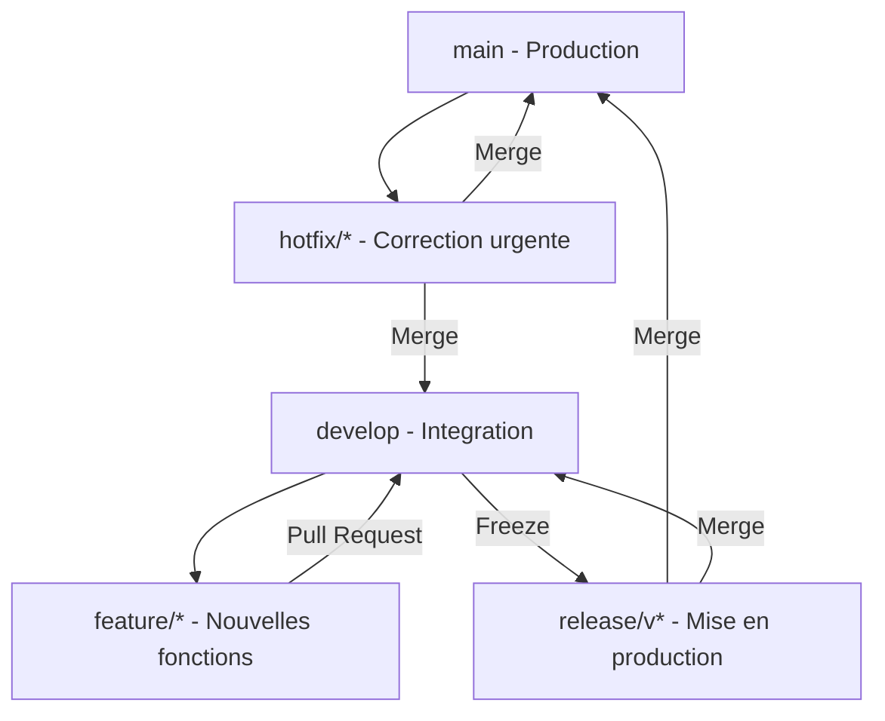
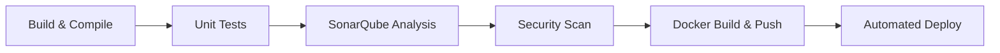

# TaskManager - API REST & Pipeline CI/CD

Bienvenue sur le dépôt du projet **TaskManager**, réalisé dans le cadre de ma mission en tant que DevOps Engineer pour la startup **DeployFast**.

Ce projet a pour double objectif de fournir une API métier robuste (développée en Spring Boot) et de mettre en place un pipeline d'intégration et de déploiement continu (CI/CD) complet respectant les standards DevSecOps.

---

## 🏗️ 1. Conception Architecturale et Modélisation

Avant de coder l'application, j'ai défini l'architecture et la structure de données pour répondre aux besoins de l'équipe de développement.

### 1.1 Objectifs Fonctionnels

L'application doit permettre la gestion de tâches personnelles de manière sécurisée.

* **Acteurs** : Utilisateurs classiques (chacun gère ses propres tâches) et Administrateurs (gestion globale).
* **Fonctions clés** :
  * Authentification des accès par JWT.
  * Création, consultation, modification et suppression de tâches (CRUD).
  * Pagination des résultats pour optimiser les performances réseau.
* **Choix techniques** :
  * J'ai opté pour le framework **Spring Boot** (Java) pour la partie Backend afin de garantir robustesse, typage fort et intégration facile avec SonarQube et nos outils CI/CD.
  * Développement orienté Test (TDD) avec une couverture visée de > 60%.

### 1.2 Schéma de Base de Données

Pour la persistance, j'ai modélisé deux tables principales reliées entre elles :

* **`users`** : Gère l'identité des utilisateurs.

  | Champ | Type | Contrainte |
  | ----- | ---- | ---------- |
  | `id` | BIGINT | PK, AUTO_INCREMENT |
  | `username` | VARCHAR(50) | UNIQUE, NOT NULL |
  | `email` | VARCHAR(100) | UNIQUE, NOT NULL |
  | `password` | VARCHAR(255) | NOT NULL (haché BCrypt) |
  | `role` | ENUM | NOT NULL, DEFAULT 'USER' |

* **`tasks`** : Contient les informations des tâches à réaliser.

  | Champ | Type | Contrainte |
  | ----- | ---- | ---------- |
  | `id` | BIGINT | PK, AUTO_INCREMENT |
  | `user_id` | BIGINT | FK → users(id), CASCADE DELETE |
  | `title` | VARCHAR(150) | NOT NULL |
  | `description` | TEXT | NULLABLE |
  | `status` | ENUM | NOT NULL, DEFAULT 'PENDING' |
  | `priority` | ENUM | NOT NULL, DEFAULT 'MEDIUM' |
  | `due_date` | DATE | NULLABLE |

**Contraintes d'intégrité :** `ON DELETE CASCADE` sur `user_id` — supprimer un utilisateur entraîne la suppression de toutes ses tâches. Le `title` est obligatoire (min 3 caractères, validé côté Bean Validation).

### 1.3 Documentation de l'API REST

J'ai conçu l'API pour être prédictive et respecter les standards RESTful HTTP. Toutes les routes sont préfixées par `/api/v1`.

#### Authentification (publique)

| Méthode | Route | Description | Status Codes |
| ------- | ----- | ----------- | ------------ |
| POST | `/api/v1/auth/register` | Inscription d'un nouvel utilisateur | 201 Created, 400, 409 Conflict |
| POST | `/api/v1/auth/login` | Authentification (génération du token JWT) | 200 OK, 401 Unauthorized |

#### Tâches (JWT requis)

| Méthode | Route | Description | Status Codes |
| ------- | ----- | ----------- | ------------ |
| GET | `/api/v1/tasks` | Lister les tâches de l'utilisateur (paginé) | 200 OK, 401 |
| POST | `/api/v1/tasks` | Créer une nouvelle tâche | 201 Created, 400 |
| GET | `/api/v1/tasks/{id}` | Voir les détails d'une tâche | 200 OK, 403, 404 |
| PUT | `/api/v1/tasks/{id}` | Mettre à jour une tâche | 200 OK, 400, 403, 404 |
| DELETE | `/api/v1/tasks/{id}` | Supprimer la tâche | 204 No Content, 403, 404 |

#### Administration (ADMIN uniquement)

| Méthode | Route | Description | Status Codes |
| ------- | ----- | ----------- | ------------ |
| GET | `/api/v1/admin/users` | Lister tous les utilisateurs | 200 OK, 401, 403 |
| DELETE | `/api/v1/admin/users/{id}` | Supprimer un utilisateur | 204 No Content, 403, 404 |

#### Format standardisé des erreurs

Toutes les erreurs retournent un JSON uniforme géré par le `GlobalExceptionHandler` :

```json
{
  "timestamp": "2026-03-09T10:00:00",
  "status": 404,
  "error": "Not Found",
  "message": "Tâche introuvable avec l'id : 42",
  "path": "/api/v1/tasks/42"
}
```

### 1.4 Architecture du Code (Clean Code & SOLID)

Pour assurer une bonne séparation des responsabilités et faciliter la testabilité (TDD), j'ai organisé le projet en architecture N-Tiers :

```
src/main/java/org/demo/taskmanager/
├── controller/
│   ├── AuthController.java      # Endpoints /auth (public)
│   ├── TaskController.java      # Endpoints /tasks (authentifié)
│   └── AdminController.java     # Endpoints /admin (ADMIN uniquement)
├── service/
│   ├── AuthService.java         # Logique inscription/connexion
│   ├── TaskService.java         # Logique métier des tâches
│   └── UserService.java         # Gestion des utilisateurs (admin)
├── repository/
│   ├── UserRepository.java      # Accès données users (JPA)
│   └── TaskRepository.java      # Accès données tasks (JPA)
├── model/
│   ├── User.java                # Entité JPA + UserDetails
│   ├── Task.java                # Entité JPA Task
│   ├── Role.java                # Enum : USER, ADMIN
│   ├── TaskStatus.java          # Enum : PENDING, IN_PROGRESS, COMPLETED
│   └── TaskPriority.java        # Enum : LOW, MEDIUM, HIGH
├── dto/
│   ├── auth/                    # LoginRequest, RegisterRequest, AuthResponse
│   ├── task/                    # TaskRequest, TaskResponse
│   └── ErrorResponse.java       # Format d'erreur standardisé
├── security/
│   ├── JwtUtils.java            # Génération/validation JWT
│   ├── JwtAuthFilter.java       # Filtre HTTP JWT
│   └── SecurityConfig.java      # Config Spring Security (STATELESS)
└── exception/
    ├── GlobalExceptionHandler.java   # @RestControllerAdvice
    └── ResourceNotFoundException.java
```

1. **Controller** : N'effectue aucun traitement métier. Reçoit la requête, délègue au Service, retourne la réponse.
2. **Service** : Cœur du système. Logique métier et vérification des droits d'accès (un user ne peut modifier que ses propres tâches).
3. **Repository** : Interfaces Spring Data JPA pour l'accès aux données.
4. **DTO** : Dissocie l'API de la structure interne des entités (on n'expose jamais le mot de passe, le user_id interne, etc.)

### 1.5 Justification des choix techniques

| Choix | Justification |
| ----- | ------------- |
| **Spring Boot 4 + Java 21** | Dernière LTS, records Java pour les DTOs, performance JVM améliorée |
| **Spring Security + JWT (Stateless)** | Pas de gestion de session serveur, scalable horizontalement, adapté aux APIs REST contenteurisées |
| **MySQL (prod) + H2 (tests)** | MySQL robuste pour la production, H2 en mémoire pour des tests rapides sans dépendance externe |
| **Flyway (migrations SQL)** | Gestion versionnée du schéma de base de données, reproductible sur tous les environnements (local, CI, prod) |
| **Lombok `@Builder`, `@Data`** | Réduit le boilerplate Java, code plus lisible et maintenable (Clean Code) |
| **DTOs (Request/Response)** | Sécurise les données exposées (pas de fuite de mot de passe haché), découple l'API de la DB |
| **`@RestControllerAdvice`** | Gestion centralisée des exceptions, réponses d'erreur cohérentes sur toute l'API (DRY) |
| **Versioning `/api/v1`** | Permet des évolutions futures de l'API sans casser les clients existants |
| **Principe SOLID** | S: une classe = une responsabilité / D: injection de dépendances via constructeur / I: interfaces Repository séparées |

### 1.6 Stratégie de Branching (GitFlow)

Pour assurer la stabilité du code et permettre des déploiements prédictibles, j'ai adopté la stratégie **GitFlow** :



* **`main`** : Code de production stable (taggé par version).
* **`develop`** : Branche d'intégration pour les nouvelles fonctionnalités.
* **`feature/*`** : Développement isolé de nouvelles fonctionnalités.
* **`hotfix/*`** : Correctifs critiques en production.

---

## 🚀 2. Mise en Place du Pipeline CI/CD (Question 3 & 4)

Pour industrialiser le projet, j'ai conçu un pipeline automatisé permettant d'assurer la qualité et la sécurité du code à chaque modification.

### 2.1 Stratégie de Déploiement

* **GitHub Actions** : Outil choisi pour l'automatisation des workflows.
* **Flow Git** :
  * Les développeurs travaillent sur des branches de fonctionnalités.
  * Chaque `Pull Request` vers `main` déclenche le pipeline de validation.
  * Le succès du pipeline est obligatoire pour fusionner le code.

### 2.2 Étapes du Pipeline (Workflow)



1. **Build** : Compilation Maven avec Java 17.
2. **Unit & Integration Tests** : Validation du code (JUnit 5, Mockito, Testcontainers).
3. **Analyse Qualité (SonarQube)** : Scan de la dette technique via `sonar-maven-plugin`.
4. **DevSecOps (OWASP Scan)** : Vérification des vulnérabilités des dépendances via `dependency-check-maven`.
5. **Conteneurisation Multi-stage** : Création d'une image Docker sécurisée (utilisateur non-root).
6. **Publication DockerHub** : Push automatique sur `docker.io/USERNAME/taskmanager-api`.
7. **Déploiement Continu** : Orchestration via Docker Compose.

---

## 🛠️ 3. Instructions d'Exécution et Déploiement (Question 5)

### 3.1 Prérequis

* Docker & Docker Compose
* JDK 17 & Maven (pour le développement local)

### 3.2 Lancement avec Docker Compose

Pour démarrer l'ensemble de l'infrastructure (API + MySQL) en une seule commande :

```bash
docker-compose up -d --build
```

L'API sera accessible sur `http://localhost:8080` et la base de données sur le port `3306`.

### 3.3 Déploiement CI/CD

Le pipeline est configuré via **GitHub Actions** (`.github/workflows/ci-cd.yml`).

* **Secrets à configurer sur GitHub** :
  * `DOCKERHUB_USERNAME` : Votre identifiant DockerHub.
  * `DOCKERHUB_TOKEN` : Votre token d'accès DockerHub.

---

## ✨ 4. Optimisations et Clean Code (Question 6)

### 4.1 Modularité et Performance

* **Build Multi-stage** : Le `Dockerfile` utilise deux étapes (Build & Run) pour réduire la taille de l'image finale (basée sur Alpine Linux) et ne pas inclure le code source ou Maven dans l'image de production.
* **Cachage Maven** : Le pipeline GitHub Actions utilise un système de cache pour les dépendances Maven, accélérant les builds successifs de plusieurs minutes.

### 4.2 Résolution de Problèmes (Troubleshooting)

* **Échec de connexion DB** : L'application utilise un `healthcheck` Docker pour s'assurer que MySQL est prêt avant de démarrer le backend (`depends_on: condition: service_healthy`).
* **JWT Secret** : En production, le secret JWT doit être injecté via une variable d'environnement `APP_JWT_SECRET`.
* **Hot Reloading (DevTools)** : Intégration de `spring-boot-devtools` pour accélérer le développement local.
* **OpenAPI Recursion Fix** : Correction d'une erreur 500 sur Swagger UI via l'utilisation de DTOs (`UserResponse`) et l'annotation `@JsonIgnore` pour casser les références circulaires entre `User` et `Task`.
* **Tests de Couverture** : Ajout de tests d'intégration pour tous les contrôleurs (`AuthController`, `TaskController`, `AdminController`).

---

### 📑 Document rédigé dans le cadre de l'examen BC01

DevOps Engineer – Startup DeployFast – Mars 2026
